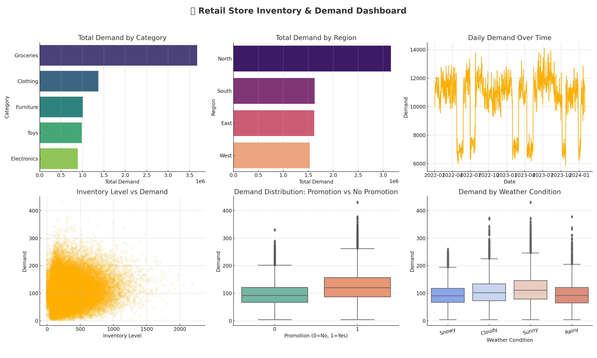
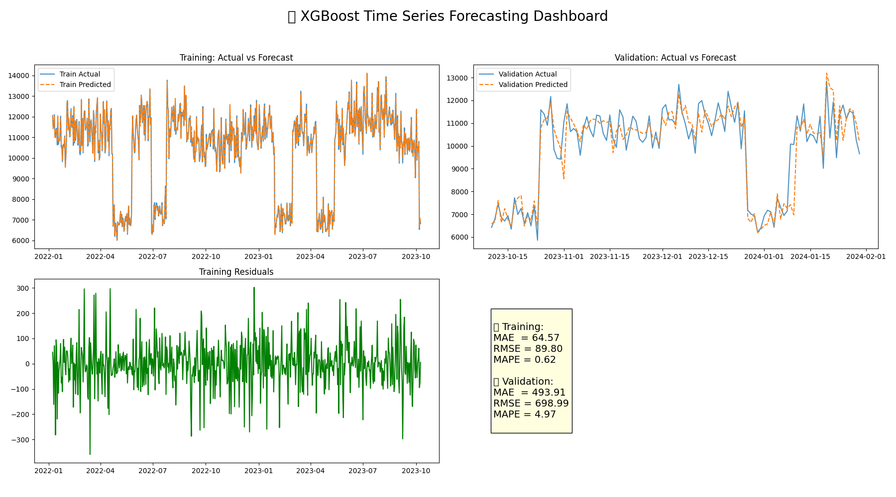

### 3. Time Series Forecasting Pipeline
> **Multi-horizon demand forecasting with automated model selection and deployment**

**📈 Business Problem:** Retail companies struggle with inventory management due to inaccurate demand forecasting. Poor forecasting leads to stockouts (lost sales) or overstock (carrying costs), resulting in millions in losses annually.

** Target Metrics:**
- **MAPE < 10%** for short-term forecasts (1-4 weeks)
- **RMSE improvement > 15%** over baseline methods
- **95% prediction intervals** for uncertainty quantification
- **Business Impact:** $500K annual savings in inventory costs

**Dataset Source:** 
- **Retail Store Demand Forecast** (76000 rows, 2 years)
- **Forecast Target**: Demand (units sold per day)
- **Features:** Historical demand, promotion flags, discount rates, inventory levels
- **External data:** Weather, weather condition, holiday indicators
- **Engineered features:** lag values, rolling averages, standard deviations
- [Dataset](https://www.kaggle.com/datasets/atomicd/retail-store-inventory-and-demand-forecasting)

**Technical Highlights:**
- Classical time series methods (ARIMA, Exponential Smoothing)
- Modern ML approaches (XGBoost Regressor, LSTM, Transformer models)
- Feature engineering with lag variables and rolling statistics
- Automated hyperparameter optimization with Optuna
- Time-aware splitting: Avoided data leakage using chronological train–validation strategy
- Seasonal decomposition and trend analysis

**Tech Stack:** Python, Prophet, ARIMA, xgboost, PyTorch, Optuna, MLflow, Streamlit, Plotly

**Output Preview:**

